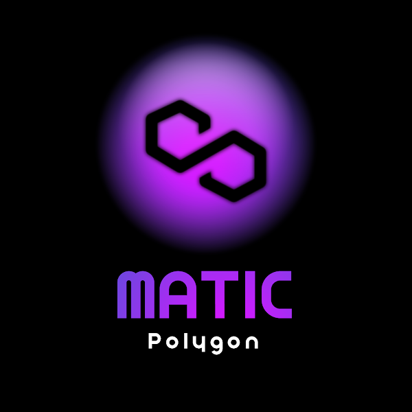

 
  

<h1 align="center"> Matic Gatherer </h1>
<h3 align="center"> Xiaoran Wei </h3>
<h5 align="center"> Blockchain Presence - Development Team </h5>

 
  

<!-- TABLE OF CONTENTS -->
<h2 id="table-of-contents"> :book: Table of Contents</h2>

  
Table of Contents

  <ol>
    <li><a href="#about-matic-gatherer"> ➤ About Matic Gatherer</a></li>
    <li><a href="#functions"> ➤ Functions</a></li>
    <li><a href="#getting-started"> ➤ Getting Started</a></li>
    <li><a href="#credits"> ➤ Credits</a></li>
    <li><a href="#licence"> ➤ Licence</a></li>
  </ol>

<!-- ABOUT MATIC GATHERER -->
<h2 id="about-matic-gatherer"> :pencil: About Matic Gatherer</h2>

 
  Need some test matic on Polygon Mumbai testnet for testing? Get tired of troublesome faceut website? Want larger amount of test matic but don't want to bothered by the request limit?

 
This matic gatherer can easily solve all your problems! 

Let's get started!

<!-- FUNCTIONS -->
<h2 id="functions"> :clipboard: Functions</h2>

 
<table>
<tr>
<td>

<h3>What can we use it for?</h3>
<ul>
    <li>Automatically get test matic from polygon faceut</li>
    <li>Generate multiple account address for getting matic, no 10 matic limit worries </li>
    <li>Transfer accumulated matic from multiple accounts to your specified account</li>
</ul>

</td>
</tr>
</table>

<!-- GETTING STARTED -->
<h2 id="getting-started"> :pager: Getting Started</h2>

<h3>🧬  If you need LESS than 10 MATIC :</h3>

You can use the light version `matic_gatherer.js` by typing the following commands in the command line:

:small_orange_diamond: simply run  node matic-gather [your account address]

<pre><code>node matic-gatherer `your account address`</code></pre>

:small_orange_diamond: For Windows System:

<pre><code>node ./matic-gatherer.js  `your account address`</code></pre>

:small_orange_diamond: after the account get 10 matic, it will show the error:

<pre><code>error: "Matic Tokens are ideally used to pay for gas, the address you're requesting from has enough to pay for gas. If you require in bulk please contact us on Discord.</code></pre>

<h3>🧬  If you need MORE than 10 MATIC :</h3>

You can use the standard version `matic_gatherer-v2.js` by typing the following commands in the command line:

:small_blue_diamond: simply run  node matic-gather-v2 [your account address]

<pre><code>node matic-gatherer-v2 `your account address`</code></pre>

:small_blue_diamond: For Windows System:

<pre><code>node ./matic-gatherer-v2.js  `your account address`</code></pre>

<i>Note that all of the commands that appear in this project also appear in <code>getmatic.md</code>, for easy copying and pasting.</i>

<!-- CREDITS -->
<h2 id="credits"> :scroll: Credits</h2>

Xiaoran Wei

<!-- LICENCE-->
<h2 id="licence"> 💠  Licence</h2>

Copyright (c) 2022 Xiaoran Wei.

Licensed under the <a href="https://github.com/weixia0824/weixia0824/blob/46f77bc5db55feba2228fd2f7c85aeef6d538102/LICENSE">MIT license </a>.

